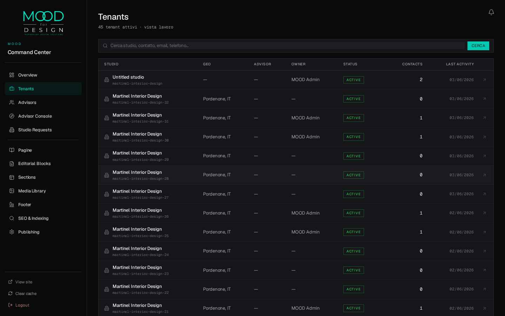
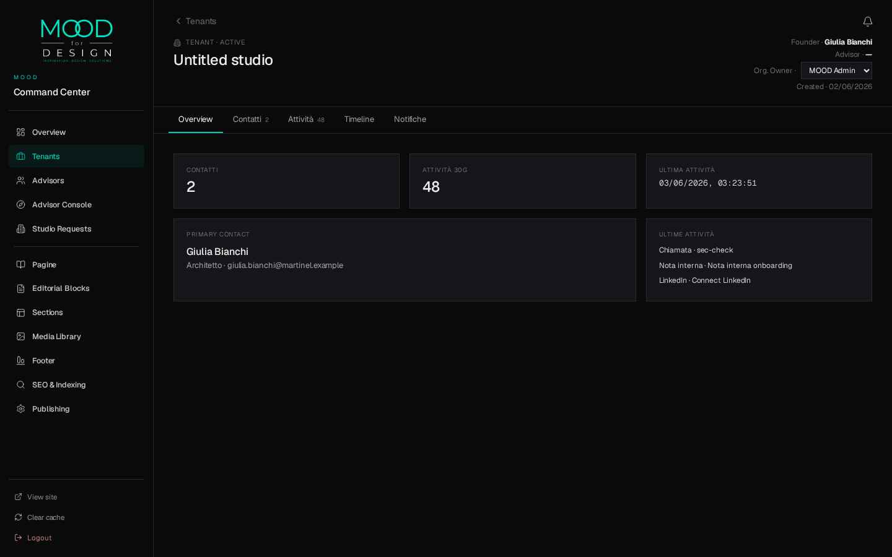
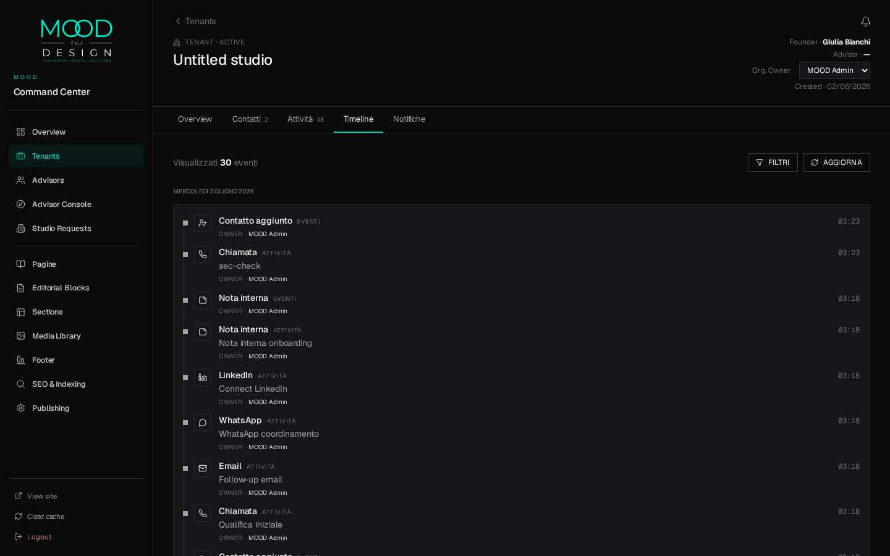
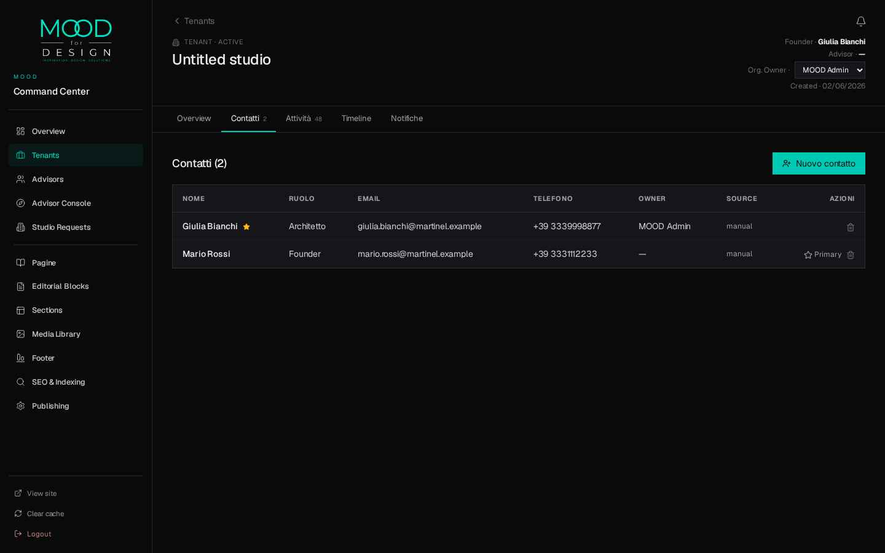
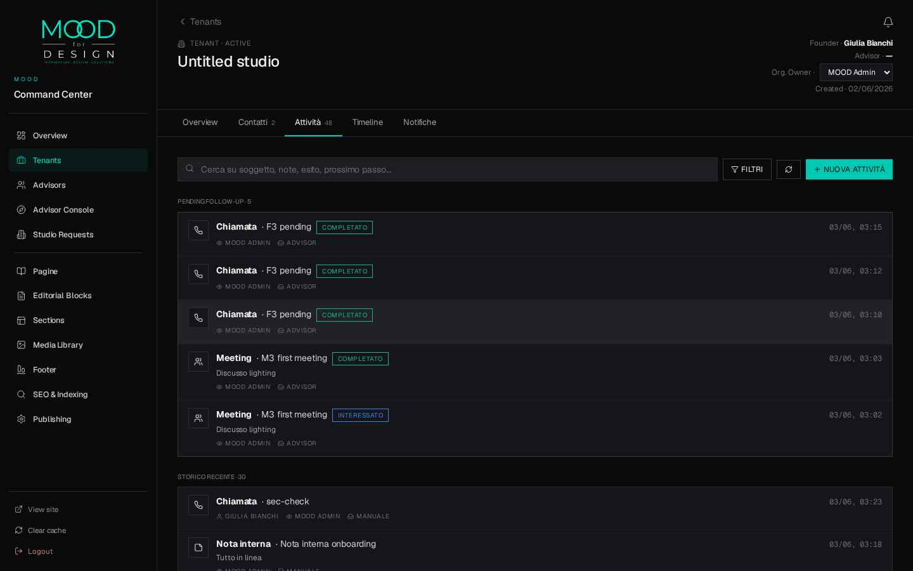
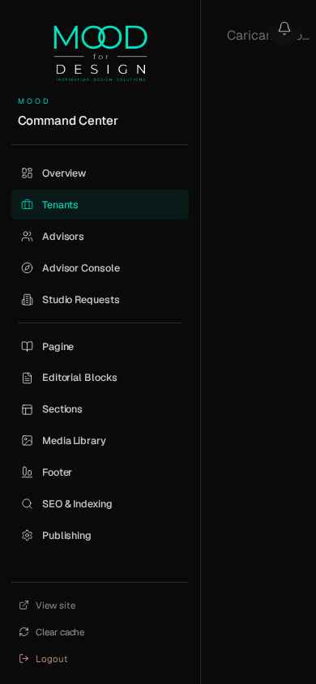

# FUNCTIONAL LUXURY — FASE 2 · VISUAL REVIEW

**Solo evidenza visiva. Niente teoria.**

---

### 1. Tenant List

Header denso, 45 tenant attivi, search + filter chips, righe py-3, status chip teal-on-dark, last-activity tabular-nums a destra. **Pattern Attio/Airtable-base, NON Linear** — colonne resizable, sort, density modes restano da implementare in FASE 3 quando avremo Saved Views.

---

### 2. Tenant Detail · Overview

KPI cards `fl-kpi` (Contatti 2 · Attività 30g 48 · Ultima attività). Header Geist 24px. Tabs minimal con underline teal. Founder/Advisor/Org.Owner allineati a destra. **Risposta a "Chi sto seguendo / Cosa è successo / Chi è responsabile"** in ~2s. ⚠️ "Untitled studio" è dato sporco del tenant (relation.studio_name = null), non bug di stile.

---

### 3. Timeline

Ledger cronologico denso, day-grouping ("MERCOLEDÌ 3 GIUGNO 2026"), eyebrow source (`EVENTI` / `ATTIVITÀ`), icone neutre 14px, owner inline, time tabular-nums a destra. **❗ L'Inline Accordion expansion non è ancora implementato** — è scope FASE 3 come da decisione. Stato attuale: lista compatta non espandibile.

---

### 4. Contatti

Tabella dense, Primary star amber, ruoli da catalog, ownership e source visibili. CTA "Nuovo contatto" teal su dark. **Quick actions (Star/Archive) sempre visibili a destra** — non hover-only.

---

### 5. Attività · con Quick Actions sempre visibili

Sezione **PENDING FOLLOW-UP · 5** in cima, poi STORICO RECENTE. Outcome chip (`COMPLETATO`, `INTERESSATO`) sempre visibili. Ownership (`MOOD ADMIN`) + source (`ADVISOR`/`MANUALE`) inline. Time tabular-nums. CTA "+ Nuova attività" teal. **Tutto sempre visibile, zero hover-only.**

---

### 6. Mobile (viewport 390×844, iPhone 14)

**Stato reale, dichiarato apertamente:** Il `WorkspaceShell` è desktop-first e su mobile la sidebar 248px occupa ~64% del viewport, spingendo il contenuto fuori. **Non è regressione FASE 2 — il mobile non è mai stato ottimizzato.** Per ora non blocker (admin/advisor lavorano da desktop). Backlog: collapse-to-hamburger sotto 768px.

---

## Problemi ancora aperti

1. **Timeline accordion expansion** → FASE 3 (come da plan)
2. **Mobile responsive** → backlog post-M5
3. **`<select>` nativo Org.Owner** → da migrare a shadcn Select in FASE 3
4. **"Untitled studio"** → dato sporco, non bug; in FASE 3 fallback elegante a `tenant.name` con label "(da completare)"

---

**In attesa di approvazione o respingimento FASE 2.**
