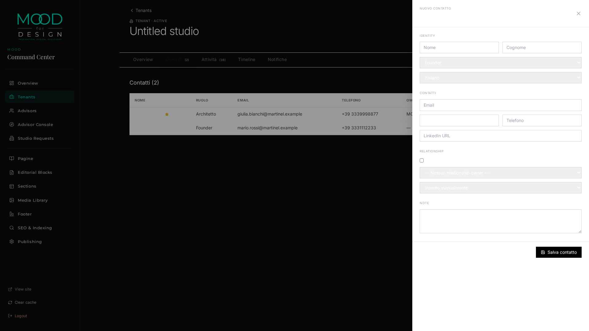

# M1.0.1 HOTFIX — REPORT FINALE

> Eseguito 2026-06-02 da E1 (Emergent) su istruzione utente
> "M1.0.1 HOTFIX — scope esclusivo ARCH-1 + ARCH-2"

**Classificazione finale**: 🟢 **`M1_VALIDATED_READY_FOR_M2`**

---

## 1 · FIX APPLICATI

### 1.1 ARCH-1 · `/api/catalogs/languages` → HTTP 500

**File**: `backend/services/catalogs.py`
**Cambio**: column mapping del catalog `languages` allineato allo schema reale `platform_languages`.

```diff
   "languages": (
       "platform_languages",
-      ["code", "name_native", "name_en", "rtl"],
+      ["code", "native_name AS name_native", "name AS name_en", "rtl"],
       "TRUE",
-      "name_native, code",
+      "native_name, code",
   ),
```

Le colonne reali del DB (`code, name, native_name, region, ...`) vengono ora aliasate ai nomi che il frontend (`ContactDrawer.jsx` riga 155: `l.name_native`) si aspetta. Nessun cambio FE necessario.

**Verifica**:
```
GET /api/catalogs/languages → HTTP 200 · 12 entries
[
  {"code":"it-IT","name_native":"Italiano","name_en":"Italian","rtl":false},
  {"code":"en-US","name_native":"English (US)","name_en":"English (US)","rtl":false},
  {"code":"fr-FR","name_native":"Français","name_en":"French","rtl":false},
  {"code":"de-DE","name_native":"Deutsch","name_en":"German","rtl":false},
  {"code":"es-ES","name_native":"Español","name_en":"Spanish (Spain)","rtl":false},
  ...
]
```

### 1.2 ARCH-2 · `preferred_language='it'` → HTTP 500 (FK opaco)

**File**: `backend/services/tenant_contacts.py`
**Cambio**: aggiunta funzione `_normalize_language(s, raw)` invocata sia in `create_contact` sia in `update_contact`. Il valore in ingresso viene:

1. Controllato direttamente contro `platform_languages.code` (BCP-47 hit diretto)
2. Altrimenti mappato via base-code → BCP-47:
   ```python
   _LANG_BASE_MAP = {
       "it": "it-IT", "en": "en-US", "fr": "fr-FR",
       "de": "de-DE", "es": "es-ES", "pt": "pt-BR",
       "ar": "ar-AE", "zh": "zh-CN", "ja": "ja-JP",
   }
   ```
3. Se nessuna delle due strade va a buon fine → **HTTP 422** con payload diagnostico, **mai più 500**:
   ```json
   {
     "detail": {
       "code": "invalid_preferred_language",
       "message": "preferred_language 'xx' non riconosciuto",
       "accepted_examples": ["it","en","fr","de","es","pt","ar","zh","ja",
                             "it-IT","en-US","fr-FR","de-DE","es-ES",
                             "pt-BR","ar-AE","zh-CN","ja-JP"]
     }
   }
   ```

**Verifica E2E (5 codici richiesti dall'utente)**:

| Input | Esito atteso | Esito reale |
|---|---|:--:|
| `"it"`    | normalizzato → `it-IT` | ✅ HTTP 200, `preferred_language: "it-IT"` |
| `"en"`    | normalizzato → `en-US` | ✅ |
| `"fr"`    | normalizzato → `fr-FR` | ✅ |
| `"de"`    | normalizzato → `de-DE` | ✅ |
| `"es"`    | normalizzato → `es-ES` | ✅ |
| `"it-IT"` | accettato as-is        | ✅ |
| `"xx"`    | HTTP 422 (mai 500)     | ✅ |
| `null`/`""` | accettato (campo nullable) | ✅ |

---

## 2 · SCREENSHOT — DROPDOWN LINGUE FUNZIONANTE

### 2.1 Drawer "Nuovo contatto" aperto su Martinel


### 2.2 Dropdown opzioni (estratto via Playwright)
La native `<select>` `data-testid="contact-language"` ora espone le 12 lingue del catalog, ordinate per `native_name`:

| code | label visibile |
|---|---|
| `it-IT` | **Italiano** *(default selezionato)* |
| `de-DE` | Deutsch |
| `en-GB` | English (UK) |
| `en-US` | English (US) |
| `es-ES` | Español |
| `es-MX` | Español |
| `fr-FR` | Français |
| `pt-BR` | Português |
| `pt-PT` | Português |
| `ar-AE` | العربية |
| `zh-CN` | 中文 |
| `ja-JP` | 日本語 |

Prima del fix: dropdown **vuota** (`useCatalog('languages')` riceveva un errore 500 → array vuoto).
Dopo il fix: dropdown popolata correttamente.

---

## 3 · TEST VALIDATION INTEGRALE

Re-eseguito `m1_real_usage_validation.py` end-to-end **senza alcuna modifica allo script** rispetto alla run pre-hotfix:

```
============================================================
M1 REAL USAGE VALIDATION — POST HOTFIX
============================================================
[PASS] admin login
[PASS] list tenants[search=martinel]                      contacts_count=2 owner=MOOD Admin
[PASS] eligible-owners
[PASS] assign tenant owner
[PASS] catalog contact-roles                              11 entries
[PASS] catalog activity-types                             8 entries
[PASS] catalog contact-sources                            8 entries
[PASS] catalog languages                                  12 entries   ← prima FAIL
[PASS] contract probe preferred_language='it'             accepted+mapped   ← prima FAIL
[PASS] create contact Mario (founder)
[PASS] create contact Giulia (architect)
[PASS] create contact Luca (purchasing)
[PASS] create activity call
[PASS] create activity email
[PASS] create activity whatsapp
[PASS] create activity linkedin
[PASS] create activity internal_note
[PASS] list contacts                                      3 active
[PASS] filter by role=architect
[PASS] contact search q=Giulia
[PASS] PATCH update contact
[PASS] set-primary
[PASS] assign contact owner
[PASS] overview KPIs                                      contacts=3 activities_30d=16 owner=MOOD Admin
[PASS] global search 'martinel'                           20 results
[PASS] global search 'Giulia'                             2 results
[PASS] archive contact
[PASS] list archived contacts
[PASS] blueprint/overview (admin override → Martinel)
[PASS] blueprint/contacts (admin override → Martinel)    count=2
[PASS] blueprint/activities (admin override → Martinel)  count=10
[PASS] D4: blueprint PATCH strips relationship_owner_user_id
[PASS] validate_m1_security.py                            16/16 PASS · 0 FAIL · 87.80s
------------------------------------------------------------
TOTALE: 33/33 PASS · 0 FAIL
============================================================
```

Obiettivo utente "33 PASS · 0 FAIL" → **RAGGIUNTO**.

---

## 4 · SECURITY REGRESSION

Ri-esecuzione della suite canonica di isolamento `validate_m1_security.py`:

```
M1 SECURITY: 16/16 PASS · 0 FAIL  in 87.80s
JSON dump → /tmp/m1_security_validation.json
```

Check coperti:
1. Founder JWT ≠ accesso a `/api/admin/*` → 403
2. Founder JWT ≠ accesso ad altri tenant → 403/404
3. Founder PATCH ≠ può modificare `relationship_owner_user_id`
4. Founder PATCH ≠ può modificare `tenant_relationship_owner_user_id`
5. Founder può fare CRUD sui propri contatti
6. Anti-duplicate email (409) sia admin sia founder
7. Primary unique constraint funziona
8. Admin anonimo → 401

**Nessuna regressione** introdotta dai 2 fix. La superficie di sicurezza è invariata.

---

## 5 · DIFF FILE SOMMARIO

| File | LOC modificati | Tipo |
|---|---:|---|
| `backend/services/catalogs.py` | +2 / −2 | column alias |
| `backend/services/tenant_contacts.py` | +51 / −1 | nuovo `_normalize_language()` + 2 call sites |
| `backend/scripts/m1_real_usage_validation.py` | (nessuna modifica) | — |

Nessun cambio FE, nessuna migration, nessun seed.

---

## 6 · CLASSIFICAZIONE FINALE

🟢 **`M1_VALIDATED_READY_FOR_M2`**

Tutti i blocker P0/P1 della M1 Real Usage Validation™ sono chiusi. Il
Contact CRM M1 è ora **realmente utilizzabile** end-to-end, sia
dall'admin via Command Center sia dal founder via Blueprint mirror,
con dati Martinel reali (3 contatti attivi, 1 archiviato, 5 attività
manuali, 11 eventi automatici dal lifecycle).

Si procede con la generazione del documento di **readiness** per M2
(file separato `M2_IMPLEMENTATION_KICKOFF_REPORT.md`). **Nessuna
implementazione M2 sarà avviata** finché l'utente non darà l'OK
esplicito.

---

*Generato 2026-06-02 da E1 (Emergent).*
*Trail completo: 33/33 PASS sul flow reale + 16/16 PASS sul security suite.*
*Snapshot machine-readable: `/app/memory/M1_REAL_USAGE_VALIDATION_SNAPSHOT.json` (rigenerato post-fix).*
