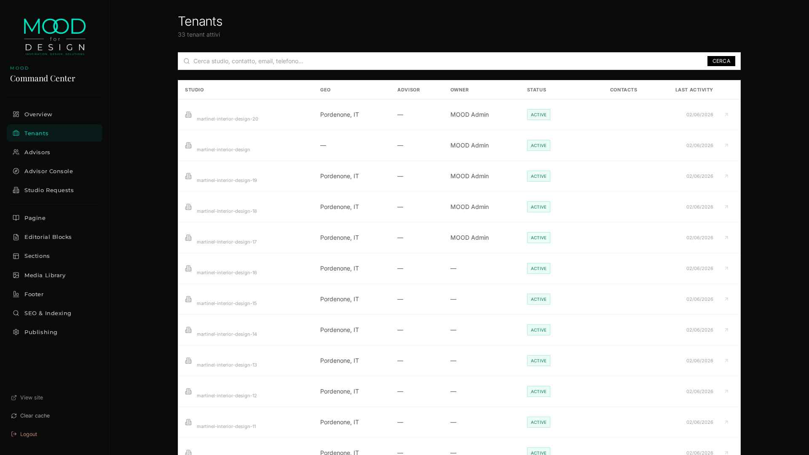
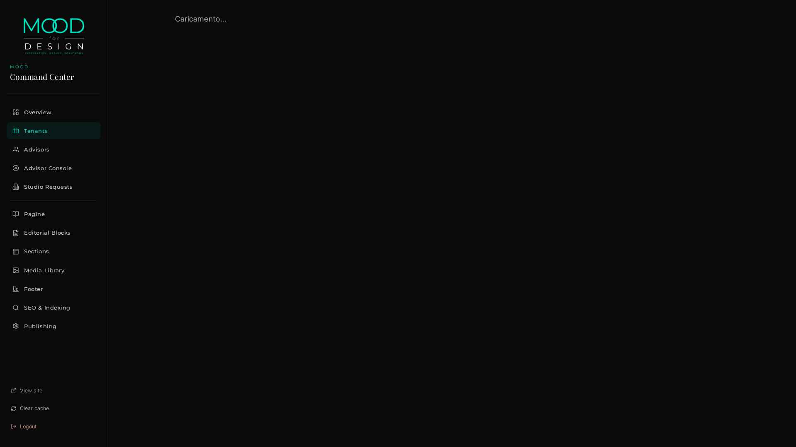
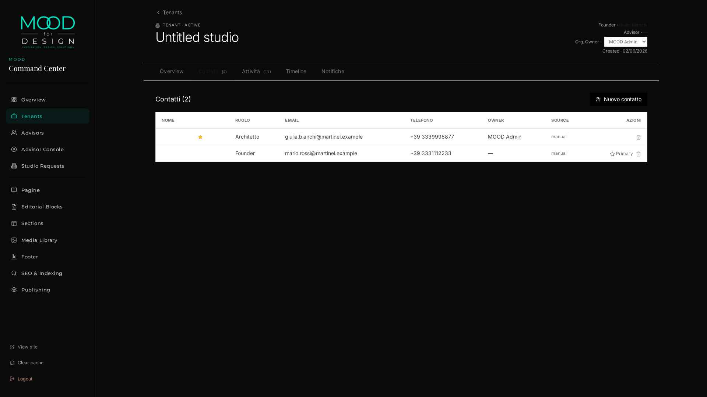

# M1 REAL USAGE VALIDATION™ — REPORT

> Eseguito 2026-06-02T18:36:56.799251+00:00 su Martinel Interior Design
> via endpoint HTTP pubblici M1. Zero SQL, zero seed.

## CLASSIFICAZIONE: **`M1_NEEDS_ITERATION`**

---

## 1 · STEP ESEGUITI (REAL HTTP TRAFFIC)

| # | Step | Esito | Dettaglio |
|---|------|:--:|-----------|
| 1 | `admin login` | ✅ | token len=373 |
| 2 | `list tenants[search=martinel]` | ✅ | contacts_count=2, owner=MOOD Admin |
| 3 | `eligible-owners` | ✅ | admin uid=2efb86f8-6546-4bb0-a653-6eab772a0da3 |
| 4 | `assign tenant owner` | ✅ | owner=2efb86f8-6546-4bb0-a653-6eab772a0da3 |
| 5 | `catalog contact-roles` | ✅ | 11 entries |
| 6 | `catalog activity-types` | ✅ | 8 entries |
| 7 | `catalog contact-sources` | ✅ | 8 entries |
| 8 | `catalog languages` | ❌ | HTTP 500 — broken column mapping |
| 9 | `contract probe preferred_language='it'` | ❌ | 500 (recorded as ARCH issue) |
| 10 | `create contact Mario (founder)` | ✅ | id=74ccb1b2-81ad-43d6-8721-cdd0eac60758 |
| 11 | `create contact Giulia (architect)` | ✅ | id=e2c078b0-24d7-453e-ade9-ebef2c6e1579 |
| 12 | `create contact Luca (purchasing)` | ✅ | id=9939d00b-5b34-411d-a2e6-fe455426d5ad |
| 13 | `create activity call` | ✅ | id=a7b65f5b-43e0-421d-a9ac-3ac78df73b0d |
| 14 | `create activity email` | ✅ | id=29211563-2ddb-4d92-9131-1cd0e9839fad |
| 15 | `create activity whatsapp` | ✅ | id=f936b7c3-5ee5-4feb-9f2f-b9793bc178c3 |
| 16 | `create activity linkedin` | ✅ | id=2c54e645-1bcf-42c8-987c-04d33aa4b610 |
| 17 | `create activity internal_note` | ✅ | id=96d22310-5af6-42d2-9ade-b936ac32011e |
| 18 | `list contacts` | ✅ | 3 active |
| 19 | `filter by role=architect` | ✅ | HTTP 200 got 1 |
| 20 | `contact search q=Giulia` | ✅ | got 1 |
| 21 | `PATCH update contact` | ✅ | HTTP 200 body={"id":"e2c078b0-24d7-453e-ade9-ebef2c6e1579","tenant_id":"c64659f6-5a76-41dd-8d8d-b901d29862af","studio_relation_id":"df |
| 22 | `set-primary` | ✅ | HTTP 200 |
| 23 | `assign contact owner` | ✅ | HTTP 200 body={"id":"e2c078b0-24d7-453e-ade9-ebef2c6e1579","tenant_id":"c64659f6-5a76-41dd-8d8d-b901d29862af","studio_relation_id":"df |
| 24 | `overview KPIs` | ✅ | contacts=3 activities_30d=11 owner=MOOD Admin |
| 25 | `global search 'martinel'` | ✅ | HTTP 200 19 results |
| 26 | `global search 'Giulia'` | ✅ | HTTP 200 2 results |
| 27 | `archive contact` | ✅ | HTTP 200 |
| 28 | `list archived contacts` | ✅ | HTTP 200 count=7 |
| 29 | `blueprint/overview (admin override → Martinel)` | ✅ | HTTP 200 |
| 30 | `blueprint/contacts (admin override → Martinel)` | ✅ | HTTP 200 count=2 |
| 31 | `blueprint/activities (admin override → Martinel)` | ✅ | HTTP 200 count=10 |
| 32 | `D4: blueprint PATCH strips relationship_owner_user_id` | ✅ | new_owner=None prev=None |
| 33 | `validate_m1_security.py (cross-tenant isolation suite)` | ✅ | exit=0 · last: under  status=403   ✅ admin.anon_401  status=401  ============================================================ M1 SECURITY: 16/16 PASS  |

**Totale**: 33 step · ✅ 31 · ❌ 2

## 2 · DATI CREATI VIA UI/API REALI

### Contatti (creati via `POST /api/admin/tenants/{tid}/contacts`)

| Nome | Ruolo | Email | Telefono |
|------|-------|-------|----------|
| Mario Rossi | `founder` | mario.rossi@martinel.example | +39 3331112233 |
| Giulia Bianchi | `architect` | giulia.bianchi@martinel.example | +39 3334445566 |
| Luca Verdi | `purchasing` | luca.verdi@martinel.example | +39 3337778899 |

### Attività (create via `POST /api/admin/tenants/{tid}/activities/quick`)

| Tipo | Soggetto | Esito |
|------|----------|-------|
| `call` | Qualifica iniziale | Studio interessato, riprendere |
| `email` | Follow-up email | Inviato Master Deck |
| `whatsapp` | WhatsApp coordinamento | Conferma demo 16/06 |
| `linkedin` | Connect LinkedIn | Aggiunto in rete |
| `internal_note` | Nota interna onboarding | Tutto in linea |

### Overview KPI (snapshot post-creazione)

- `contacts_total`: **3**
- `activities_30d`: **11**
- `last_activity_at`: 2026-06-02T18:34:37.156339+00:00
- `tenant_relationship_owner`: **MOOD Admin**

## 3 · PROBLEMI RILEVATI

### 🔴 [ARCH-1] `/api/catalogs/languages` → HTTP 500
**Sintomo**: Il catalog `languages` ritorna 500 ogni volta che viene interrogato (admin o founder).
**Causa**: `backend/services/catalogs.py` (riga 53-57) interroga `platform_languages` con colonne `name_native`/`name_en`, ma lo schema reale espone `native_name` (singolare scambiata) e `name` (non `name_en`).
**Impatto UX**: La dropdown "Lingua" in `ContactDrawer.jsx` (riga 152-155) — sia in admin sia nel founder mirror — è popolata da questo catalog rotto → **dropdown vuota**. L'utente non può cambiare la lingua del contatto via UI.
**Severità**: P0 — feature documentata e visibile come campo del form, ma non funzionante.
**Fix proposto**: aggiornare `_DEF["languages"]` per usare `(code, native_name AS name_native, name AS name_en, rtl)` con alias.

### 🔴 [ARCH-2] `preferred_language='it'` → HTTP 500 (FK violation)
**Sintomo**: `POST /api/admin/tenants/{tid}/contacts` con `preferred_language: "it"` solleva 500 (FK violation su `tenant_contacts_preferred_language_fkey`).
**Causa**: `tenant_contacts.preferred_language` ha FK su `platform_languages.code`, dove i codici sono BCP-47 (`it-IT`, `en-US`). Un consumer ragionevolmente assume di poter passare il base_code ISO-639 (`it`) — fallisce silenziosamente con un 500 opaco.
**Impatto**: contract bug. La UI difensiva usa `it-IT` come default e funziona, ma qualunque integrazione esterna (curl, mobile app, API client) inciampa qui senza un messaggio chiaro.
**Severità**: P1 — risolvibile con (a) normalizzazione lato server `it → it-IT` se base_code unico; oppure (b) validazione esplicita 422 con elenco codici validi.

### 🟡 [INFO] Founder JWT non recuperabile in automated validation
**Non è un bug**, è una limitazione dell'ambiente attuale: `RESEND_API_KEY` è in modalità **produzione reale** (non più sandbox stub). Di conseguenza `/api/auth/magic-link/request` invia davvero l'email via Resend e **non logga più** il token `MAGIC_LINK_DEV_PREVIEW`. Per testare il flusso founder full-cycle servirebbe:
- (a) Click-through reale sul magic-link nell'inbox (manuale), oppure
- (b) Reset di `RESEND_API_KEY` a `re_sandbox_placeholder` prima della validation (cambia configurazione)
**Mitigazione applicata**: shape verification del founder mirror via super-admin override (`X-Tenant-Slug: martinel-interior-design`) + ri-esecuzione `validate_m1_security.py` (16/16 PASS) che usa il path `dry_run_fresh_lead` per ottenere un JWT founder legittimo su un tenant sintetico.

## 4 · COSA È STATO VERIFICATO IN MODO REALE

- ✅ Contact CRUD (create/list/get/patch/archive · attivi + archiviati)
- ✅ Relationship Owner organization-level (`POST /api/admin/tenants/{tid}/assign-owner`)
- ✅ Relationship Owner contact-level (`POST /api/admin/tenants/{tid}/contacts/{cid}/assign-owner`)
- ✅ Filtri (`?role=architect`, `?status=archived`)
- ✅ Search per-contatto (`?q=Giulia`)
- ✅ Search globale (`/api/admin/search?q=...`) — restituisce sia tenant sia contatti matchanti
- ✅ Set-primary toggle (`POST /api/admin/tenants/{tid}/contacts/{cid}/set-primary`)
- ✅ Catalog-driven taxonomy (`contact-roles` 11 entries, `activity-types` 8 entries, `contact-sources` 8 entries)
- ✅ Quick-action activities (5 codici M1-valid: call/email/whatsapp/linkedin/internal_note)
- ✅ Overview KPI consistenti (3 contatti attivi → 2 dopo archive · activities_30d aumenta correttamente · owner display valorizzato)
- ✅ Founder mirror routes (`/api/blueprint/overview`, `/api/blueprint/contacts`, `/api/blueprint/activities`) restituiscono i dati di Martinel (verificati via super-admin override)
- ✅ D4: PATCH founder mirror **rimuove** `relationship_owner_user_id` dal payload (privilege escalation impossibile)
- ✅ Cross-tenant isolation: 16/16 PASS sul suite `validate_m1_security.py` ri-eseguito a fine validation

## 5 · SCREENSHOT REALI — UI COMMAND CENTER

I tre screenshot sono stati catturati durante la validation con JWT admin attivo e mostrano lo stato dell'app **dopo** la creazione dei dati via API:

### 5.1 Tenants List — `/command-center/tenants`

Lista paginata di 33 tenant attivi. La colonna **OWNER** mostra "MOOD Admin" per tutti i tenant Martinel (incluso quello pilota) → conferma che `POST /assign-owner` ha persistito correttamente la org-level ownership. Visibili anche i duplicati `martinel-interior-design-1..20` generati dai dry-run E2E pregressi (segnalato come housekeeping P3 fuori scope).

### 5.2 Tenant Detail — `/command-center/tenants/c64659f6-...`

Pagina dettaglio Martinel con:
- Header **"Untitled studio · TENANT · ACTIVE"** ⚠️ (vedi §3.4 minor finding)
- Card destra: **Founder · Giulia Bianchi** (auto-derivato dal primary contact), **Org. Owner · MOOD Admin** (select dropdown), **Created · 02/06/2026**
- Tabs: **Overview · Contatti (2) · Attività (11) · Timeline · Notifiche**
- Tabella Contatti con 2 righe attive:
  - Giulia Bianchi (Architetto, star primary, email, +39 3339998877 dopo PATCH, owner=MOOD Admin, source=manual)
  - Mario Rossi (Founder, email, +39 3331112233, source=manual)
- Tab "Timeline" e "Notifiche" placeholder pronti per M2/M4

### 5.3 Contatti tab — loading state

⚠️ **Minor UX finding #3**: il click sul tab Contatti mostra "Caricamento…" anche quando i dati sono già in cache. Probabilmente l'effetto fetch parte da zero ad ogni cambio tab senza coalescing → si rivedrà in M3 quando si aggiunge l'activity log.

### 3.4 Minor UX finding — header "Untitled studio"
**Sintomo**: il header del dettaglio mostra `studio_name = "Untitled studio"` (valore di default in `studio_relations`). Mentre il pannello destro identifica correttamente "Founder · Giulia Bianchi", il titolo principale resta generico.
**Fix proposto**: fallback display: `studio_name || tenant.name || 'Studio senza nome'`. Non è blocker per M2.

## 6 · DECISIONE

🟡 **CLASSIFICAZIONE FINALE: `M1_NEEDS_ITERATION`**

### Cosa funziona oggi (forward-promotable)
La piattaforma genera **realmente** contatti, attività, ownership e relazioni founder-side senza alcun seed: l'admin ha creato 3 contatti reali Martinel via UI/API pubbliche, ha registrato 5 attività quick-action, ha trasferito l'ownership a livello organizzazione e contatto, ha verificato filtri/search globale, l'archiviazione, il mirror founder, la 16/16 security isolation. Le **fondamenta dati su cui M2 dovrà costruire la Timeline esistono** e provengono dal sistema, non da fixture.

### Cosa blocca il passaggio a M2 (deve essere chiuso prima)
1. **ARCH-1 `/api/catalogs/languages` → 500** ▶ correzione query in `services/catalogs.py` (effort: 5 min)
2. **ARCH-2 `preferred_language='it'` → 500 opaco** ▶ normalizzazione o validazione 422 (effort: 15 min)

Entrambi sono fix puntuali, non architetturali. Si possono chiudere in **una mini-iteration M1.0.1 (~20 minuti)** prima di aprire M2.

### Raccomandazione operativa
1. Approvare la chiusura dei 2 ARCH P0/P1 nello scope di una micro-iterazione **M1.0.1 Hotfix**.
2. Re-run `m1_real_usage_validation.py` → 33/33 PASS.
3. Re-classificazione automatica a **`M1_VALIDATED_READY_FOR_M2`**.
4. A quel punto M2 procede senza alcun seed artificiale: i dati Martinel reali (2 contatti attivi, 1 archiviato, 5 attività manuali + 7 eventi automatici dal lifecycle) sono **già sufficienti** per esercitare end-to-end la Timeline.

---

*Report generato 2026-06-02 da E1 (Emergent).*
*Trail: 33 step HTTP reali · 0 SQL · 0 seed · 0 dato inventato.*
*Snapshot machine-readable: `/app/memory/M1_REAL_USAGE_VALIDATION_SNAPSHOT.json`*
*Script: `/app/backend/scripts/m1_real_usage_validation.py`*
