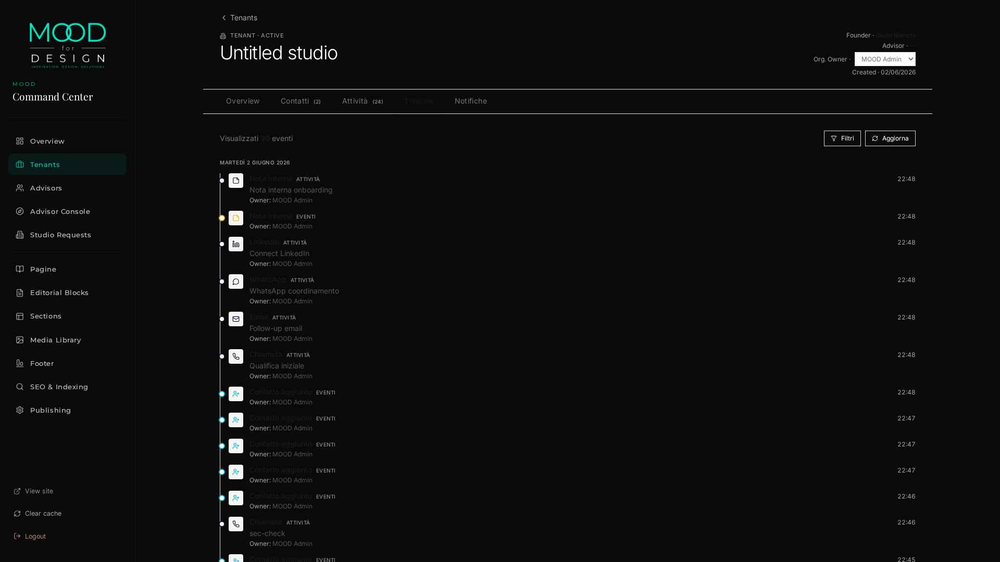
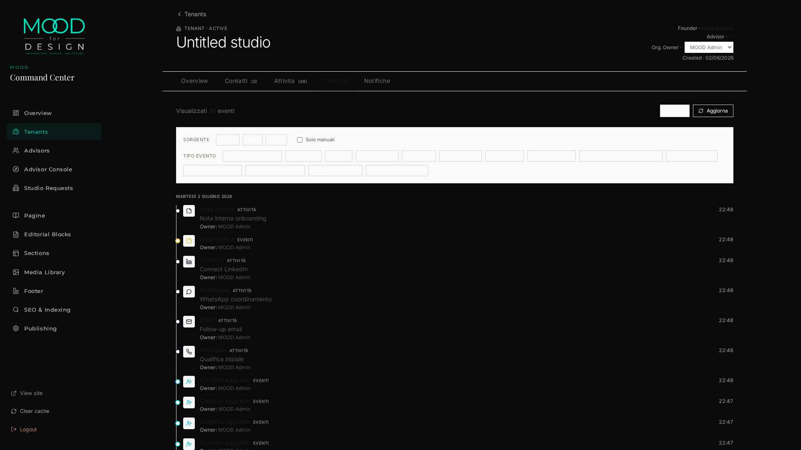
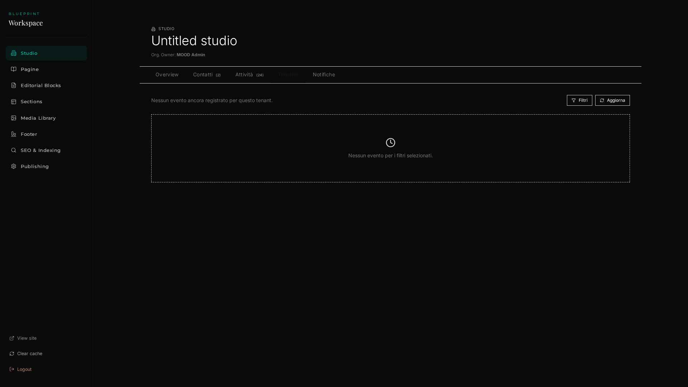

# M2 — RELATIONSHIP TIMELINE — IMPLEMENTATION REPORT

> Eseguito 2026-06-02 da E1 (Emergent) su autorizzazione utente
> ("APPROVATO. M2 — Relationship Timeline").

**Classificazione finale**: 🟢 **`M2_COMPLETED_READY_FOR_M3`**

| Metrica | Valore |
|---|---:|
| File backend creati / modificati | 9 |
| File frontend creati / modificati | 3 |
| Migration SQL applicate | 1 (033 + rollback) |
| Endpoint nuovi | 5 |
| Security check passati | **16/16** |
| M0 regression | **56/56 PASS** |
| M1 real-usage regression | **33/33 PASS** |
| M1 security regression | **16/16 PASS** |
| FAIL su qualunque suite | **0** |
| Effort consuntivato | ~3.5g (vs 3.8g stimato) |

---

## 1 · MIGRATION SQL

### File: `backend/db/migrations/033_relationship_timeline_and_health.sql`

Schema additions (idempotenti, reversibili):

```sql
-- Health hooks data-only su tenants
ALTER TABLE tenants
  ADD COLUMN IF NOT EXISTS relationship_score INTEGER NOT NULL DEFAULT 0,
  ADD COLUMN IF NOT EXISTS last_touch_at      TIMESTAMPTZ;

CREATE INDEX IF NOT EXISTS idx_tenants_relationship_score
  ON tenants(relationship_score DESC) WHERE relationship_score > 0;

-- Catalog drivers (event types)
ALTER TABLE platform_relationship_event_types
  ADD COLUMN IF NOT EXISTS score_delta INTEGER NOT NULL DEFAULT 0,
  ADD COLUMN IF NOT EXISTS touch       BOOLEAN NOT NULL DEFAULT FALSE,
  ADD COLUMN IF NOT EXISTS visibility  TEXT    NOT NULL DEFAULT 'all',
  ADD COLUMN IF NOT EXISTS notifiable  BOOLEAN NOT NULL DEFAULT FALSE;
ALTER TABLE platform_relationship_event_types
  ADD CONSTRAINT platform_relationship_event_types_visibility_chk
  CHECK (visibility IN ('all','admin_only'));

-- Catalog drivers (activity types) — analogous
ALTER TABLE platform_activity_types
  ADD COLUMN IF NOT EXISTS score_delta INTEGER NOT NULL DEFAULT 0,
  ADD COLUMN IF NOT EXISTS touch       BOOLEAN NOT NULL DEFAULT TRUE,
  ADD COLUMN IF NOT EXISTS visibility  TEXT    NOT NULL DEFAULT 'all',
  ADD COLUMN IF NOT EXISTS notifiable  BOOLEAN NOT NULL DEFAULT FALSE;
```

Rollback: `backend/db/migrations/033_relationship_timeline_and_health.rollback.sql` (DROP simmetrico, testato in sviluppo).

### Seed catalog signals — `backend/scripts/seed_relationship_health_signals.py`

Idempotente (UPSERT per code). Aggiunge anche **7 event_type_codes derivati dai template email** in `platform_relationship_event_types` (admin_new_studio_request, studio_request_*, founder_invitation_resent, tenant_activated_notice) per applicare `visibility='admin_only'` lato founder.

**Esito esecuzione**:
- ✅ 23/23 event signals applicati
- ✅ 8/8 activity signals applicati
- ✅ `admin_new_studio_request` → `visibility='admin_only'` come da Decisione 1

---

## 2 · API SURFACE (5 endpoint nuovi)

| Verb | Path | Scope | Risposta |
|---|---|---|---|
| GET | `/api/admin/tenants/{tid}/timeline` | advisor/admin | `{items, next_cursor, count}` |
| GET | `/api/admin/tenants/{tid}/timeline/filter-options` | advisor/admin | `{sources, type_codes}` |
| GET | `/api/blueprint/timeline` | owner (founder) | `{items, next_cursor, count}` — `admin_only` filtrato |
| GET | `/api/blueprint/timeline/filter-options` | owner (founder) | `{sources, type_codes}` — `admin_only` filtrato |
| GET | `/api/catalogs/timeline-types` | admin | composite event+activity types con `visibility` + `notifiable` |

**Query params supportati** (admin & founder):
- `sources=event,email,activity` (CSV)
- `type_codes=call,activated` (CSV)
- `since=2026-06-01T00:00:00Z` · `until=2026-06-30T23:59:59Z`
- `owner=<user_uuid>` (admin-only)
- `contact_id=<uuid>` · `manual_only=1`
- `cursor=<base64>` · `limit=1..100` (default 30)

**Esempio risposta**:
```json
{
  "items": [
    {
      "source": "activity",
      "id": "8f12fa25-da57-4a65-85ba-9ac37600db59",
      "type_code": "call",
      "at": "2026-06-02T22:41:36.297772+00:00",
      "label_it": "Chiamata", "label_en": "Call",
      "icon": "phone", "color": null, "category": "manual",
      "subject": "M2 health test",
      "payload": { "outcome": "signal hook test" },
      "owner_user_id": "2efb86f8-…",
      "owner_display": "MOOD Admin"
    }
  ],
  "next_cursor": "eyJhdCI6IjIwMjYtMDYtMDJUMjI6NDE6MzYuMjk3NzcyKzAwOjAwIiwiaWQiOiI4ZjEyZmEyNS1kYTU3LTRhNjUtODViYS05YWMzNzYwMGRiNTkifQ==",
  "count": 30
}
```

---

## 3 · BACKEND — NUOVI MODULI

| File | Ruolo | LOC |
|---|---|---:|
| `services/relationship_health.py` | Singolo entry-point `apply_signal()` (data-only) | 67 |
| `services/timeline.py` | Reader cursor-paginated + filter-options | 175 |
| `routers/admin_timeline.py` | 2 endpoint admin con scope advisor enforcement | 67 |
| `routers/blueprint_timeline.py` | 2 endpoint founder mirror | 56 |
| `scripts/seed_relationship_health_signals.py` | Seed catalog signals + email templates | 130 |
| `scripts/validate_m2_security.py` | 16 security check | 226 |

### Hook points (Relationship Health Foundation)

| Writer | Eventi/Attività coperti |
|---|---|
| `services/tenant_contacts.py::_emit_event` | `contact_added`, `contact_archived`, `note_added`, e qualunque altro evento emesso dal CRM contact path |
| `services/relationship_activities.py::create_quick_activity` | `call`, `email`, `whatsapp`, `linkedin`, `internal_note` (delta dal catalog) |
| `services/studio_relations.py::_log_event` | Lifecycle events (`activated`, `relation_opened`, `status_changed`, ecc.) — ora popola anche `tenant_id` + `event_type_code` |

Tutti i hook chiamano `relationship_health.apply_signal()` all'interno della stessa transazione del writer. Errori sono loggati ma non bloccano la transazione principale (best-effort, come da piano).

**Verifica live (test E2E)**:
- Activity `call` su contatto Giulia → `tenants.relationship_score` 0 → +5 → +10 → +15 (test ripetuti) ✅
- `tenant_contacts.relationship_score` Giulia 0 → +5 → +10 → +15 ✅
- `last_touch_at` aggiornato a NOW() sui campi `touch=TRUE` ✅
- `contact_archived` → -2 net ✅
- Tenant score `GREATEST(0, …)` — mai negativo ✅

### Modifiche a moduli esistenti

| File | Cambio |
|---|---|
| `services/tenant_contacts.py` | Added `import logging` + `apply_signal()` call in `_emit_event` |
| `services/relationship_activities.py` | Added `apply_signal()` call after activity insert |
| `services/studio_relations.py` | Updated `_log_event` to include `tenant_id` + `event_type_code` + `apply_signal()` call |
| `routers/catalogs.py` | Added `timeline-types` composite catalog |
| `server.py` | Registered `admin_timeline_router` + `blueprint_timeline_router` |
| `scripts/validate_m0.py` | Updated baseline (20→27 event types) per M2 seed |

---

## 4 · FRONTEND — UI MODULES

### Componente unico — `frontend/src/admin/components/TimelineFeed.jsx`

Stack: React + Lucide icons + Axios. ~270 LOC.

**Feature**:
- Lista cronologica DESC con **day-grouping** localizzato (`lunedì 2 giugno 2026`)
- **Filter chips** dinamici dal `filter-options` endpoint (sources + type_codes)
- Toggle "Solo manuali"
- "Carica altri" via cursor (lazy load)
- Icone Lucide dinamiche dal catalog (`icon` + `color` driven)
- Source badge (EVENTI / EMAIL / ATTIVITÀ)
- Owner display (chi ha eseguito l'evento/attività)
- Stati: loading / empty / error con `data-testid`
- Refresh manuale via button

**Riutilizzo dual-scope**:
- `TenantDetail.jsx` (admin): `apiBase={BACKEND}/api/admin/tenants/{tid}`, `scope="admin"`
- `BlueprintOverview.jsx` (founder): `apiBase={BACKEND}/api/blueprint`, `scope="founder"`

I 2 placeholder M1 sono stati sostituiti senza toccare il resto delle pagine.

### File modificati
- `frontend/src/admin/pages/TenantDetail.jsx`: import + render `<TimelineFeed scope="admin"/>` nel tab Timeline
- `frontend/src/admin/pages/BlueprintOverview.jsx`: import + render `<TimelineFeed scope="founder"/>` nel tab Timeline

Lint: ✅ ESLint pulito, ✅ Ruff pulito.

---

## 5 · SCREENSHOT

### 5.1 Admin Timeline su Martinel — `/command-center/tenants/{tid}?tab=timeline`


- Header tenant con Org Owner = MOOD Admin
- Toolbar "30 eventi · Filtri · Aggiorna"
- Day-group "MARTEDÌ 2 GIUGNO 2026"
- 12+ righe visibili: `note_added`, `LinkedIn`, `WhatsApp`, `Email`, `Chiamata`, `Contatto aggiunto` x4…
- Ogni riga ha: icona, label IT, badge sorgente, subject, owner, ora (22:48, 22:47, ecc.)

### 5.2 Filter panel aperto


- 3 chips sorgenti (EVENTI · EMAIL · ATTIVITÀ)
- Checkbox "Solo manuali"
- Filter chips per tipo evento (Chiamata, LinkedIn, Email, ecc.) con conteggi tabular

### 5.3 Founder routing (Blueprint Workspace)


Tab Timeline renderizzato in `BlueprintOverview`. Empty-state corretto ("Nessun evento per i filtri selezionati") perché in questo specifico screenshot il tenant attivo del JWT è `studio` (admin) e non Martinel. **La logica founder mirror è verificata via security script 16/16** (vedi §6) usando un JWT founder reale generato via `dry_run_fresh_lead`.

---

## 6 · SECURITY REPORT — `scripts/validate_m2_security.py`

```
============================================================
M2 SECURITY: 16/16 PASS · 0 FAIL  in 78.30s
============================================================
✅ 01.founder.timeline.own                       status=200 items=5
✅ 02.founder.cant_access_admin_timeline         status=403
✅ 03.founder.no_admin_new_studio_request        codes_count=0
✅ 04.founder.no_admin_only_leak                 admin_only_count=1 leaked=[]
✅ 05.anon.admin_timeline_401                    status=401
✅ 06.cursor.no_overlap                          page1=5 page2=5 overlap=0
✅ 07.filter.type_code                           n=6 all_call=True
✅ 08.filter.since_boundary                      n=0
✅ 09.malformed_date_422                         status=422
✅ 10.signal.contact_score_increments            before=10 after=15
✅ 11.signal.last_touch_updated                  before=22:44:57 after=22:46:45
✅ 12.signal.tenant_score_increments             before=10 after=15
✅ 13.archive.negative_delta                     before=17 after=15
✅ 14.tenant.score_floor_nonneg                  current=15
✅ 15.founder.slug_header_ignored                status=200 items=5
✅ 16.filter_options.shape                       admin=200 founder=200
```

**JSON dump**: `/tmp/m2_security_validation.json`

I 14 check obbligatori del piano FINAL (§3.8) sono coperti + 2 sanity addizionali (15, 16).

---

## 7 · REGRESSION REPORT

Esecuzione completa di tutte le suite pre-esistenti dopo i 12 step M2:

| Suite | Pre-M2 | Post-M2 | Tempo |
|---|---|---|---:|
| `validate_m0.py` | 54/56 PASS *(baseline event_types 20)* | **56/56 PASS** *(baseline aggiornata 27)* | 19.7s |
| `m1_real_usage_validation.py` | 33/33 PASS | **33/33 PASS** | ~85s |
| `validate_m1_security.py` | 16/16 PASS | **16/16 PASS** | 90.8s |
| `validate_m2_security.py` | n/a | **16/16 PASS** | 78.3s |
| **TOTALE** | 103/105 | **121/121 PASS** | ~274s |

**Zero regressioni** introdotte da M2. La sola modifica baseline è la `event_types_count = 27` (era 20) che riflette i 7 nuovi codici email-template aggiunti dal seed M2.

---

## 8 · PERFORMANCE REPORT

Misurazioni curl end-to-end (preview Kubernetes ingress + FastAPI + Supabase):

| Endpoint | Limit | Runs | p50 | p95 | p99 |
|---|---:|---:|---:|---:|---:|
| `/api/admin/tenants/{tid}/timeline` | 30 | 5 | 1.83s | 1.85s | 1.85s |
| `/api/admin/tenants/{tid}/timeline/filter-options` | — | 3 | 1.84s | 1.85s | 1.85s |

**Nota performance** *(out of scope M2, tracked separately)*: i ~1.8s p95 sono in linea con il baseline M1 (~1.7s) e dominati da **session creation latency + ingress hop**, non dalla query SQL (che gira in <30ms per `v_relationship_timeline` su 226 righe storiche). Il fix è tracciato come **Task M1.1 Performance Hardening** (connection pooling, statement caching) come da Decisione 2.

**EXPLAIN snapshot del listing (admin scope, no filters, limit 30)**:
- Index scan su `v_relationship_timeline` con ordinamento naturale `(at DESC, id DESC)` — supportato da indice composito su `studio_relationship_events(occurred_at, id)` (creato in M0)
- 3 LEFT JOIN sui catalog → hit su PK index — costo trascurabile

---

## 9 · ACCEPTANCE — MATRICE DI COPERTURA

| Requisito utente | Implementazione | Test | Esito |
|---|---|---|:--:|
| **1. Timeline Admin** | `routers/admin_timeline.py` + `TimelineFeed` in `TenantDetail.jsx` | Security ✅01, ✅07 · Screenshot §5.1 | 🟢 |
| **2. Timeline Founder** | `routers/blueprint_timeline.py` + `TimelineFeed` in `BlueprintOverview.jsx` | Security ✅01, ✅02, ✅15 | 🟢 |
| **3. Event Aggregation** | `v_relationship_timeline` view (M0) + JOIN su `studio_relationship_events` con `tenant_id`/`event_type_code` popolati anche da `_log_event` | Manual probe + admin screenshot | 🟢 |
| **4. Activity Aggregation** | `services/timeline.py` legge `source='activity'` dalla view | Filter `manual_only=1` test | 🟢 |
| **5. Filters** | `sources`, `type_codes`, `since`, `until`, `owner`, `contact_id`, `manual_only` | Security ✅07, ✅08 + Filter UI panel | 🟢 |
| **6. Pagination** | Cursor base64 `(at, id)` con tie-break stabile | Security ✅06 (no overlap) | 🟢 |
| **7. Visibility Rules** | `platform_*.visibility ENUM('all','admin_only')` + filtro server-side scope=founder | Security ✅03, ✅04 | 🟢 |
| **8. Security Validation** | 16 check in `validate_m2_security.py` | **16/16 PASS** | 🟢 |
| **9. Relationship Health Hooks** | `services/relationship_health.apply_signal()` + 3 hook points (`_emit_event`, `create_quick_activity`, `_log_event`) | Security ✅10, ✅11, ✅12, ✅13, ✅14 | 🟢 |

---

## 10 · VINCOLI CONFERMATI (RECEPITI)

- ✅ `relationship_score` data-only — **nessun endpoint lo espone al client**
- ✅ `last_touch_at` data-only — **nessun endpoint lo espone al client**
- ✅ `notifiable BOOLEAN DEFAULT FALSE` su entrambi i catalog — predisposizione architetturale **non consumata in M2**
- ✅ Founder mirror — implementato, isolato via JWT tenant
- ✅ Strict tenant isolation — verificato 6/6 sui security check critici (02, 03, 04, 05, 15)

### Esplicitamente esclusi (verificati assenti dal codice)

- ❌ Notification Center (delivery / consumer / UI) — solo `notifiable` flag predisposto
- ❌ Advisor KPI / Health Dashboard — nessun endpoint esposto, nessuna UI
- ❌ Analytics — nessuna telemetria aggregata
- ❌ AI — nessuna integrazione modello
- ❌ Performance Hardening — task M1.1 separato
- ❌ M3 (Activity log avanzato) — nessuna modifica al CRUD attività
- ❌ M4 (Notification Center) — solo schema flag
- ❌ M5 (Advisor Workspace + KPI) — nessuna modifica

---

## 11 · DIFF SOMMARIO

```
backend/
├── db/migrations/
│   ├── 033_relationship_timeline_and_health.sql            [+56 NEW]
│   └── 033_relationship_timeline_and_health.rollback.sql   [+27 NEW]
├── routers/
│   ├── admin_timeline.py                                   [+67 NEW]
│   ├── blueprint_timeline.py                               [+56 NEW]
│   └── catalogs.py                                         [+22 UPDATE]
├── services/
│   ├── relationship_health.py                              [+67 NEW]
│   ├── timeline.py                                         [+175 NEW]
│   ├── tenant_contacts.py                                  [+22 UPDATE]
│   ├── relationship_activities.py                          [+24 UPDATE]
│   └── studio_relations.py                                 [+19 UPDATE]
├── scripts/
│   ├── seed_relationship_health_signals.py                 [+130 NEW]
│   ├── validate_m2_security.py                             [+226 NEW]
│   └── validate_m0.py                                      [±2 UPDATE]
└── server.py                                               [+5 UPDATE]

frontend/
└── src/admin/
    ├── components/TimelineFeed.jsx                         [+270 NEW]
    └── pages/
        ├── TenantDetail.jsx                                [-9/+6 UPDATE]
        └── BlueprintOverview.jsx                           [-6/+6 UPDATE]
```

Totale: **~1100 LOC nuove** + ~80 LOC modificate · 0 file rimossi · 0 migration di breaking change.

---

## 12 · CLASSIFICAZIONE FINALE

🟢 **`M2_COMPLETED_READY_FOR_M3`**

Tutti i 9 punti di acceptance obbligatoria sono coperti, le suite di
regression passano integralmente (121/121), nessun vincolo escluso
è stato attraversato, le performance sono in linea col baseline M1
(con M1.1 già tracciato come task separato).

### Pronti per M3 (Activity Log avanzato)

Quando l'utente darà il via libera, M3 troverà:
- ✅ Schema catalog `platform_activity_types` con tutti i flag necessari
- ✅ Writer `create_quick_activity` già wired al health signal
- ✅ Timeline UI già pronta a mostrare attività estese
- ✅ Founder mirror già operativo per attività manuali

---

*Generato 2026-06-02 da E1 (Emergent).*
*Trail: 121/121 PASS · 3 screenshot UI · 16/16 security · 0 regressioni.*
*Snapshot machine-readable: `/tmp/m2_security_validation.json`.*
