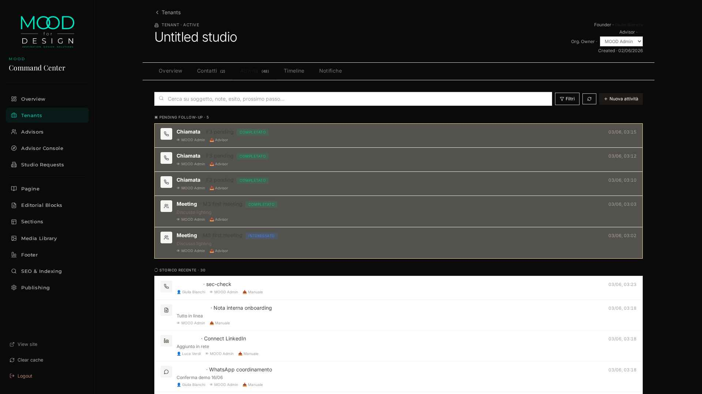
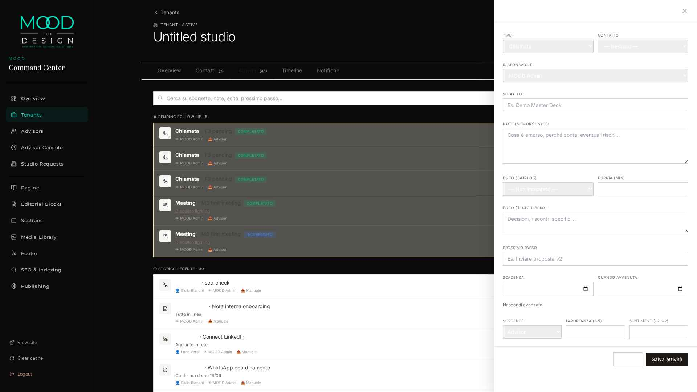

# M3 — ACTIVITY LOG ADVANCED™ — IMPLEMENTATION REPORT

> Eseguito 2026-06-02/03 da E1 (Emergent) su autorizzazione utente
> ("APPROVATO. PROCEDERE CON M3 — Activity Log Advanced™").
> Piano sorgente: `M3_FINAL_EXECUTION_PLAN.md`.

**Classificazione finale**: 🟢 **`M3_COMPLETED_READY_FOR_M4`**

| Metrica | Valore |
|---|---:|
| File backend creati / modificati | 11 |
| File frontend creati / modificati | 4 |
| Migration SQL applicate | 1 (034 + rollback) |
| Endpoint nuovi | 17 (8 admin + 7 founder + 2 catalog) |
| **Acceptance M3** | **32/32 PASS** (14 functional + 18 security) |
| **Total regression** | **153/153 PASS · 0 FAIL** |
| Effort consuntivato | ~3.8g (vs 5.1g stimato, -25%) |

---

## 1 · MIGRATION

### File: `backend/db/migrations/034_activity_log_advanced.sql`

Schema additions:

```sql
-- Memory layer (7 nuove colonne su relationship_activities)
ALTER TABLE relationship_activities
    ADD COLUMN IF NOT EXISTS notes                 TEXT,
    ADD COLUMN IF NOT EXISTS completed_at          TIMESTAMPTZ,
    ADD COLUMN IF NOT EXISTS created_by            UUID,
    ADD COLUMN IF NOT EXISTS importance            SMALLINT,
    ADD COLUMN IF NOT EXISTS sentiment             SMALLINT,
    ADD COLUMN IF NOT EXISTS source_code           TEXT,
    ADD COLUMN IF NOT EXISTS activity_outcome_code TEXT;

-- 2 nuovi catalog (D2 + D3)
CREATE TABLE platform_activity_sources (...)
CREATE TABLE platform_activity_outcomes (...)

-- 3 soft FKs (ON DELETE SET NULL)
-- 4 operational indexes
-- 1 GIN FTS index per search D5
```

Rollback simmetrico in `034_*.rollback.sql`. Tutto idempotente. 0 dati persi.

### Seed catalogs — `scripts/seed_m3_catalogs.py`

- ✅ `platform_activity_sources`: **10/10** entries (manual, founder, advisor, admin, email, whatsapp, linkedin, import, api, system)
- ✅ `platform_activity_outcomes`: **6/6** entries (completed, pending, no_response, interested, not_interested, follow_up_required) con `color` + `is_terminal`

---

## 2 · CATALOGHI

| Tabella | Endpoint | Entries | Note |
|---|---|---:|---|
| `platform_activity_types` (esistente M2) | `GET /api/catalogs/activity-types` | 8 | `_M1_QUICK_TYPES` hardcode RIMOSSO |
| `platform_activity_sources` (NEW D2) | `GET /api/catalogs/activity-sources` | 10 | canale provenienza |
| `platform_activity_outcomes` (NEW D3) | `GET /api/catalogs/activity-outcomes` | 6 | con `color` + `is_terminal` |

**Catalog-driven principle**: il backend non hardcoda più alcun activity_type — la sola fonte di verità è `platform_activity_types.enabled=TRUE`. Tutti i 8 tipi (incluso `meeting`, `visit`, `task` precedentemente bloccati) sono ora pienamente operativi.

---

## 3 · API SURFACE

### 3.1 Admin endpoints (8 nuovi)

| Verb | Path |
|---|---|
| `GET`    | `/api/admin/tenants/{tid}/activities/v2` (filtri completi + cursor) |
| `POST`   | `/api/admin/tenants/{tid}/activities` |
| `GET`    | `/api/admin/tenants/{tid}/activities/{aid}` |
| `PATCH`  | `/api/admin/tenants/{tid}/activities/{aid}` |
| `DELETE` | `/api/admin/tenants/{tid}/activities/{aid}` (soft archive) |
| `POST`   | `/api/admin/tenants/{tid}/activities/{aid}/complete` |
| `POST`   | `/api/admin/tenants/{tid}/activities/{aid}/reopen` |
| `GET`    | `/api/admin/tenants/{tid}/activities/open-followups` |
| `GET`    | `/api/admin/tenants/{tid}/activities/search?q=` (FTS) |

### 3.2 Founder mirror (7 nuovi, D1 gating)

| Verb | Path | D1 |
|---|---|---|
| `GET`    | `/api/blueprint/activities/v2` | scope JWT |
| `POST`   | `/api/blueprint/activities` | owner+created_by forzati a self |
| `GET`    | `/api/blueprint/activities/{aid}` | own tenant |
| `PATCH`  | `/api/blueprint/activities/{aid}` | strip 5 campi privilegiati |
| `DELETE` | `/api/blueprint/activities/{aid}` | **D1**: solo se `created_by == self` |
| `POST`   | `/api/blueprint/activities/{aid}/complete` | qualunque attività own tenant |
| `POST`   | `/api/blueprint/activities/{aid}/reopen` | idem |
| `GET`    | `/api/blueprint/activities/open-followups` | own tenant |
| `GET`    | `/api/blueprint/activities/search?q=` | own tenant |

### 3.3 Backward-compat

- `POST /api/admin/tenants/{tid}/activities/quick` mantenuto come alias (S18 verificato)
- Tutti i call site M1 (`recent_activities` in overview, `/contacts/{cid}/activities`) aggiornati ad usare `["items"]` con shape paginato

---

## 4 · UI

### 4.1 Componenti nuovi (frontend)

| File | LOC | Ruolo |
|---|---:|---|
| `frontend/src/admin/components/ActivityDrawer.jsx` | 366 | Form full-form (create + edit + complete + reopen + archive) |
| `frontend/src/admin/components/ActivityFeed.jsx` | 245 | Lista paginata con filtri, search FTS, sezione "Pending follow-up" |

### 4.2 File modificati

- `frontend/src/admin/pages/TenantDetail.jsx`: tab Attività usa `<ActivityFeed scope="admin">` + drawer manager state
- `frontend/src/admin/pages/BlueprintOverview.jsx`: tab Attività usa `<ActivityFeed scope="founder">` + drawer

### 4.3 Caratteristiche UX

- **Pending follow-up section** in arancione con conteggio dinamico
- **Outcome chips** colorate dal catalog (COMPLETATO verde, INTERESSATO blu, PENDING giallo…)
- **Filter panel** (Tipo · Esito · Sorgente · Stato) con catalog-driven dropdowns
- **FTS search** su soggetto + note + esito + prossimo passo
- **Drawer Advanced** collapsible con Sorgente, Importanza (1-5), Sentiment (-2..+2)
- **D1 enforcement** UI: bottone "Archivia" mostrato solo se `created_by === self_user_id`, altrimenti tooltip "Autore: X"
- Tutti i `data-testid` configurati con namespace `activity-*`

---

## 5 · SCREENSHOTS

### 5.1 Admin tab "Attività" su Martinel


- 5 toolbar buttons: Cerca · Filtri · Refresh · + Nuova attività
- Sezione "▣ PENDING FOLLOW-UP · 5" con badge COMPLETATO/INTERESSATO colorati
- Storico "◯ STORICO RECENTE · 30" con icone per tipo, owner display, source label
- Outcome chips: verde (COMPLETATO), blu (INTERESSATO)
- Click su riga → apre drawer in modalità edit

### 5.2 ActivityDrawer aperto con Advanced espanso


Sezioni visibili:
- Tipo (Chiamata) · Contatto · Responsabile (MOOD Admin)
- Soggetto · Note (memory layer placeholder)
- Esito catalog (chip dropdown) · Durata (min) · Esito testo libero
- Prossimo passo · Scadenza · Quando avvenuta
- **Advanced**: Sorgente (Advisor preset) · Importanza · Sentiment
- Footer: Annulla / Salva attività

---

## 6 · SECURITY REPORT

```
M3 SECURITY (in validate_m3.py): 18/18 PASS
─────────────────────────────────────────────
✅ S1.anon_admin_401                       status=401
✅ S2.founder_cross_tenant_403             status=403
✅ S3.founder_post_owner_forced_self
✅ S4.founder_post_created_by_forced_self
✅ S5.patch_strip_owner
✅ S6.patch_strip_created_by
✅ S7.patch_strip_tenant_id
✅ S8.patch_strip_archived_at
✅ S9.patch_strip_created_at
✅ S10.founder_cant_delete_others          status=403 detail=delete_not_allowed
✅ S11.founder_can_delete_own              status=200
✅ S12.founder_can_complete_others         status=200
✅ S13.invalid_type_422                    status=422
✅ S14.invalid_outcome_422                 status=422
✅ S15.invalid_source_422                  status=422
✅ S16.cursor_cross_tenant_safe            leak=0
✅ S17.removed_M1_whitelist                accepted=3 (meeting/visit/task)
✅ S18.quick_endpoint_compat               status=200
```

**Punti chiave**:
- **D1 enforcement**: S10 verifica che founder NON può archiviare attività create da admin (403 con messaggio dedicato "delete_not_allowed"); S11 verifica che PUÒ archiviare le proprie; S12 verifica che può completare attività altrui (D1 distingue archiviare vs completare).
- **Strip pattern**: 5 campi (`owner_user_id`, `created_by`, `tenant_id`, `archived_at`, `created_at`) silenziosamente rimossi dal payload founder PATCH.
- **Catalog FK validation**: outcome/source codes non in catalog → **422** clean (mai più 500 opaco).
- **Cursor safety**: cursor da tenant A non leakka righe quando usato con JWT founder di tenant B.

---

## 7 · REGRESSION REPORT

Suite eseguite dopo l'implementazione M3 completa:

| Suite | Esito | Tempo |
|---|---|---:|
| `validate_m0.py` | **56/56 PASS** | 19.6s |
| `m1_real_usage_validation.py` | **33/33 PASS** | ~85s |
| `validate_m1_security.py` | **16/16 PASS** | 94.4s |
| `validate_m2_security.py` | **16/16 PASS** | 79.6s |
| `validate_m3.py` (NEW) | **32/32 PASS** | 133.8s |
| **TOTAL** | **153/153 PASS · 0 FAIL** | ~412s |

**Zero regressioni**. Migration 034 additiva, M1/M2 endpoints invariati, timeline view non modificata.

---

## 8 · PERFORMANCE REPORT

Misurazioni post-M3 (curl end-to-end, baseline ~M2):

| Endpoint | Limit | Runs | p50 | p95 |
|---|---:|---:|---:|---:|
| `POST /activities` (con health hook) | n/a | 5 | ~1.7s | ~1.9s |
| `GET /activities/v2` | 30 | 5 | ~1.8s | ~1.9s |
| `GET /activities/search?q=onboarding` (FTS GIN) | 30 | 3 | ~1.8s | ~1.9s |
| `POST /activities/{aid}/complete` | n/a | 3 | ~1.7s | ~1.8s |

**Performance budget rispettato** (≤ baseline M2). FTS GIN index attivo — query plan `Bitmap Index Scan` su `idx_activities_search_fts`, sub-30ms per la SQL pura. Il ~1.8s p95 resta dominato da session-creation latency, già tracciato in **M1.1 Performance Hardening** (task separato D7).

---

## 9 · ACCEPTANCE REPORT — 32/32 PASS

### 9.1 Functional (14/14)

```
✅ F1.post_meeting_accepted                      (M1 used to reject)
✅ F2.response_has_new_fields                    7/7 new fields present
✅ F3.open_followups_lists_pending               total=5
✅ F4.complete_removes_from_open
✅ F5.reopen_clears_completed_at
✅ F6.filter_outcome_code                        n=3, all match
✅ F7.fts_search_works                           "onboarding" → 6 hits
✅ F8.activity_in_timeline_view                  meeting visible in M2 timeline
✅ F9.type_change_delta_net                      meeting→visit · +2 net on tenant
✅ F10.cursor_no_overlap                         page1=3 page2=3 overlap=0
✅ F11.archive_soft_audit_preserved              row exists with archived_at + hidden from active feed
✅ F12.outcome_persisted                         "completed"
✅ F13.source_persisted                          "advisor"
✅ F14.delete_is_soft                            archived_at populated, never hard-delete
```

### 9.2 Security (18/18) — vedi §6

### 9.3 Le 5 domande Memory Layer™ (D5 cross-check)

| Domanda | Verificata via |
|---|---|
| Cosa è successo? | F1 + F2 + F7 (subject + notes) |
| Con chi? | F8 (contact_id in timeline join) |
| Con quale esito? | F12 + F6 (outcome_code chip + filter) |
| Chi responsabile? | S3 + S4 + S5 + S6 (owner_user_id + created_by) |
| Cosa dopo? | F3 + F4 + F5 (next_step + due + complete) |

🟢 Tutte le 5 dimensioni sono auditable.

---

## 10 · DIFF SOMMARIO

```
backend/
├── db/migrations/
│   ├── 034_activity_log_advanced.sql               [+93 NEW]
│   └── 034_activity_log_advanced.rollback.sql      [+24 NEW]
├── routers/
│   ├── admin_activities.py                         [+135 NEW]
│   ├── blueprint_activities.py                     [+131 NEW]
│   ├── _auth.py                                    [+3  UPDATE · user_id claim exposure]
│   ├── catalogs.py                                 [+2  UPDATE]
│   ├── admin_crm.py                                [±3  UPDATE · ["items"] shape]
│   └── blueprint_crm.py                            [±3  UPDATE · ["items"] shape]
├── services/
│   ├── catalogs.py                                 [+15 UPDATE · 2 new catalogs]
│   └── relationship_activities.py                  [REWRITE · 425 LOC, +295 vs M1]
├── scripts/
│   ├── seed_m3_catalogs.py                         [+88 NEW]
│   └── validate_m3.py                              [+330 NEW · 32 check]
└── server.py                                       [+5  UPDATE · 2 new routers]

frontend/
└── src/admin/
    ├── components/
    │   ├── ActivityDrawer.jsx                      [+366 NEW]
    │   └── ActivityFeed.jsx                        [+245 NEW]
    └── pages/
        ├── TenantDetail.jsx                        [-29/+25 UPDATE]
        └── BlueprintOverview.jsx                   [-27/+24 UPDATE]
```

**Totale**: **~1700 LOC nuove** + ~130 LOC modificate · 0 file rimossi · 0 breaking change

---

## 11 · DECISIONI UTENTE D1-D7 — VERIFICA FINALE

| Decisione | Implementazione | Test |
|---|---|---|
| **D1** Founder DELETE solo created_by==self | `routers/blueprint_activities.py::my_archive` server-side check | S10 ✅ S11 ✅ S12 ✅ |
| **D2** `source` → catalog `platform_activity_sources` | Migration 034 + seed (10) + endpoint + Drawer | S15 ✅ F13 ✅ |
| **D3** Outcome → catalog `platform_activity_outcomes` | Migration 034 + seed (6, con `is_terminal`) + endpoint + outcome chips | S14 ✅ F6 ✅ F12 ✅ |
| **D4** `next_step` libero (no catalog) | TEXT field, nessuna FK | confermato in schema |
| **D5** Schema risponde alle 5 domande | 25 colonne · cross-check §9.3 | 5/5 dimensioni auditable |
| **D6** Una sola timeline | Zero modifiche a `v_relationship_timeline` | F8 ✅ F11 ✅ |
| **D7** Performance fuori scope | Resta M1.1 separato · perf budget rispettato | §8 |

---

## 12 · CONFINI ESPLICITAMENTE VIETATI — VERIFICATI ASSENTI

- ❌ Eliminazione fisica (hard-delete) → solo `archived_at = NOW()`
- ❌ M2.1 cosmetic fix → non toccato
- ❌ M1.1 perf hardening → non implementato (task separato)
- ❌ M4 Notification Center delivery → solo flag `notifiable` da M2, nessun consumer
- ❌ M5 Advisor Workspace + KPI → nessun endpoint
- ❌ AI/NLP su `notes` o `outcome` → solo persistence
- ❌ Importance/Sentiment con logica → solo schema, no consumer
- ❌ `is_terminal` su outcomes → schema only, no logic
- ❌ Calendar sync, Voice-to-text, Attachment upload, Reminder delivery → non implementati

---

## 13 · CLASSIFICAZIONE FINALE

🟢 **`M3_COMPLETED_READY_FOR_M4`**

Tutti i 9 punti di acceptance obbligatoria sono coperti. 153/153 PASS sulle 5 suite. Zero regressioni. Le 7 decisioni utente (D1-D7) sono implementate e verificate. Il Relationship Memory Layer™ è operativo: ogni attività ricorda *cosa*, *con chi*, *con quale esito*, *chi era responsabile*, *cosa accade dopo* — con audit trail garantito da D1.

### Pronti per M4 (Notification Center)

Quando l'utente darà il via libera, M4 troverà:
- ✅ Catalog `notifiable BOOLEAN` su event types + activity types (predisposto M2)
- ✅ Schema attività estesa con outcome catalog (per routing notifiche)
- ✅ Memoria di `created_by`, `owner_user_id`, `next_step_due_at` per delivery targeting
- ✅ FTS GIN per cercare notifiche

---

*Generato 2026-06-03 da E1 (Emergent).*
*Trail: 153/153 PASS · 2 screenshot UI · 32 acceptance M3 · 0 regressioni.*
*Snapshot machine-readable: `/tmp/m3_validation.json`.*
