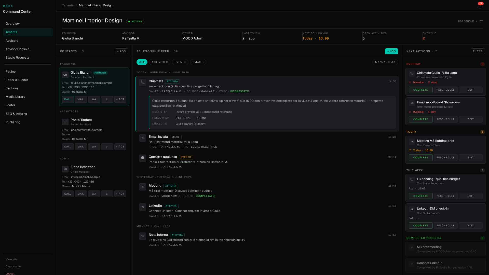
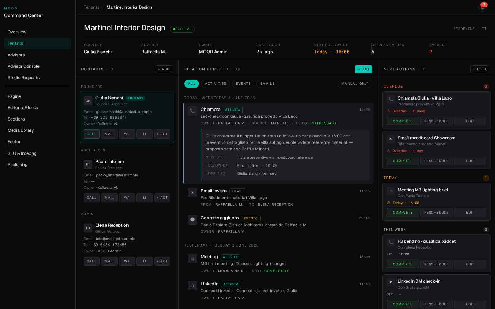
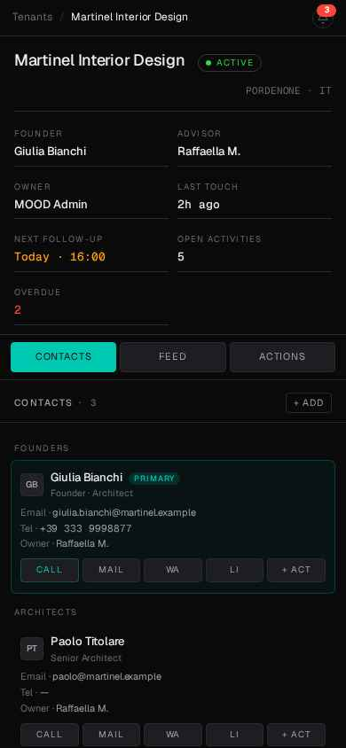

# M6.0 — RELATIONSHIP DASHBOARD · FOUNDATION

> **Modalità: architetturale, non cosmetica.**
> Vincolo invalicabile: nessuna nuova migration, tabella, endpoint, service, business logic, score, KPI, workflow. Riutilizzo totale di M1·M2·M3·M4.

---

## 1. Tesi architetturale

Smettere di trattare il tenant come **un record con 5 tab di dettaglio** (Overview / Contacts / Activities / Timeline / Notifications).
Iniziare a trattarlo come **una relazione viva con tre stati operativi simultanei**:

| Domanda operativa | Pannello che la risolve |
|---|---|
| Chi è coinvolto? | **Colonna 1 · Contacts** |
| Cosa è successo? | **Colonna 2 · Relationship Feed** (Timeline + Activities unificati) |
| Cosa devo fare adesso? | **Colonna 3 · Next Actions** |

Le tab spariscono. La Dashboard è la **home stessa** del tenant.

---

## 2. Wireframe (ASCII canonical)

```text
┌─────────────────────────────────────────────────────────────────────────────────────────┐
│ BREADCRUMB   Tenants  /  Martinel Interior Design                              🔔(3)    │
├─────────────────────────────────────────────────────────────────────────────────────────┤
│  Martinel Interior Design  ● ACTIVE                                  PORDENONE · IT     │
│  ───────────────────────────────────────────────────────────────────────────────────    │
│  FOUNDER       │ ADVISOR     │ OWNER       │ LAST TOUCH │ NEXT FOLLOW-UP │ OPEN │ OVERDUE│
│  Giulia B.     │ Raffaella M.│ MOOD Admin  │ 2h ago     │ Today · 16:00  │  5   │  2     │
├──────────────────┬────────────────────────────────────────────────────┬─────────────────┤
│ CONTACTS    +Add │ RELATIONSHIP FEED                          +Log    │ NEXT ACTIONS    │
│                  │ [All] [Activities] [Events] [Emails]               │                 │
│ FOUNDERS         │                                                    │ ⚠ OVERDUE   (2) │
│ ┌── GB ──────┐   │ TODAY · WED 4 JUN 2026                             │ ┌─────────────┐ │
│ │ Giulia B.  │   │ ┌── 14:30 · Chiamata · ATTIVITÀ                    │ │ Chiamata    │ │
│ │ PRIMARY    │   │ │ sec-check con Giulia · Villa Lago                │ │ Giulia · 2d │ │
│ │ ✉  📞  WA  │   │ │ Owner Raffaella · Esito INTERESSATO              │ │ [Complete]  │ │
│ │ in  +ACT   │   │ │ ┌──── INLINE EXPANSION ──────────────────┐       │ │ [Reschedule]│ │
│ └────────────┘   │ │ │ Giulia conferma budget. Follow-up Gio  │       │ │ [Edit]      │ │
│                  │ │ │ 16:00 con preventivo + 3 moodboard...  │       │ └─────────────┘ │
│ ARCHITECTS       │ │ │ Next step · Inviare preventivo         │       │ ┌─────────────┐ │
│ ┌── PT ──────┐   │ │ └─────────────────────────────────────────┘      │ │ Email Show. │ │
│ │ Paolo T.   │   │ │                                                  │ │ Overdue 1d  │ │
│ │ ✉  📞  WA  │   │ │ 11:05 · Email inviata · EMAIL                    │ │ [...]       │ │
│ │ in  +ACT   │   │ │ Re: Riferimenti materiali Villa Lago             │ └─────────────┘ │
│ └────────────┘   │ │ From Raffaella → To Elena                        │                 │
│                  │ │                                                  │ ⏱ TODAY     (1) │
│ ADMIN            │ │ 09:14 · Contatto aggiunto · EVENTO               │ ┌─────────────┐ │
│ ┌── ER ──────┐   │ │ Paolo Titolare creato da Raffaella               │ │ Meeting M3  │ │
│ │ Elena R.   │   │ │                                                  │ │ 16:00 today │ │
│ │ ✉  📞  WA  │   │ │ YESTERDAY · TUE 3 JUN 2026                       │ │ [...]       │ │
│ │ in  +ACT   │   │ │ 16:40 · Meeting · ATTIVITÀ                       │ └─────────────┘ │
│ └────────────┘   │ │ M3 first meeting · Esito COMPLETATO              │                 │
│                  │ │                                                  │ THIS WEEK   (2) │
│                  │ │ 11:18 · LinkedIn · ATTIVITÀ                      │ […]             │
│                  │ │ Connect Linkedin                                 │                 │
│                  │ │                                                  │ COMPLETED   (2) │
│                  │ │ MON 2 JUN 2026                                   │ [strikethrough] │
│                  │ │ 17:55 · Nota interna · ATTIVITÀ                  │                 │
│                  │ └──────────────────────────────────────────────────│                 │
└──────────────────┴────────────────────────────────────────────────────┴─────────────────┘
   ⮡  Colonna 1                          Colonna 2                            Colonna 3
       300px                              fluid (min 560px)                      340px
```

---

## 3. Mockup reali (HTML statico)

**File live:** `/app/frontend/public/_relationship_dashboard_mockup.html`
**URL preview:** `https://editorial-platform-4.preview.emergentagent.com/_relationship_dashboard_mockup.html`

### 3.1 Desktop 1920×1080


### 3.2 Desktop 1440×900


### 3.3 Mobile 390×844 (iPhone 14)


Su mobile le 3 colonne diventano **single-column con tab strip sticky in alto** (`[Contacts][Feed][Actions]`). L'header operativo collassa da 7 celle in riga a una griglia 2×4 con bordi orizzontali.

---

## 4. Header tenant — spec campi (zero KPI inutili)

| Campo | Sorgente dati (esistente) | Endpoint M-* |
|---|---|---|
| Studio name | `overview.relation.studio_name \|\| tenant.name` | M1 `GET /tenants/{tid}/overview` |
| Status pill | `overview.tenant.status` | M1 |
| Geo (eyebrow) | `overview.relation.city, country` | M1 |
| Founder | `overview.primary_contact.first_name + last_name` | M1 |
| Advisor | `overview.relation.advisor_display` | M1 |
| Owner | `overview.tenant.tenant_owner_display` (denormalizzato da M4) | M1+M4 |
| Last Touch | `overview.kpis.last_activity_at` → formattato relativo (`2h ago`) | M3 |
| Next Follow-up | `GET /activities/open-followups?limit=1` ordinato per `due_at ASC` | M3 |
| Open Activities | `count(open-followups)` (client-side dal payload sopra) | M3 |
| Overdue Activities | `count(open-followups dove due_at < now())` | M3 |

**Banditi** dall'header: `contacts_count`, `activities_30d`, `last_activity_at` come numero astratto. Non aiutano a decidere.

---

## 5. Colonna 1 · Contacts (riuso M1)

**Dati:** `GET /api/admin/tenants/{tid}/contacts` (già esistente)
**Raggruppamento (client-side):** by `role_code` → `Founders` / `Architects` / `Admin` / altro.
**Primary contact:** primo in lista, card evidenziata con accent border.
**Quick Actions sempre visibili:**

| Action | Target | Implementazione |
|---|---|---|
| Call | `tel:+39...` | `<a href="tel:…">` — zero backend |
| Mail | `mailto:…?subject=Re: tenant` | `<a href="mailto:…">` |
| WA | `https://wa.me/39…` | link diretto |
| LinkedIn | `linkedin.com/in/{slug}` se contact ha LinkedIn | link diretto |
| +Act | apre `ActivityDrawer` esistente con `contact_id` pre-fillato | M3 component invariato |

**Nessun nuovo service.** Click Call/Mail/WA/LI non logga nulla: l'attività la logga l'advisor manualmente con `+Act`.

---

## 6. Colonna 2 · Relationship Feed (UNIFICAZIONE M2+M3)

**Dati:** `GET /api/admin/tenants/{tid}/timeline` (endpoint M2 già esistente).

⚠ **Punto critico già risolto dall'architettura M2:** l'endpoint `/timeline` **già unifica** `event` + `email` + `activity` come tre `source` di un unico stream cronologico. Quindi NON serve scrivere logica di unione: M2 lo fa già. La tab "Timeline" attuale **è già un superset di "Activities"**, lo storico delle attività vi compare con `source='activity'`.

**Filter chips:** `All / Activities / Events / Emails / Manual only` (i filtri sono già esposti da `/timeline/filter-options`).

**Inline accordion (NUOVO comportamento UI, ZERO backend):**
- Click su `feed-item` → toggle `expanded` (state locale React, `Set<itemId>`)
- L'item espanso mostra: full notes, outcome, next-step, follow-up due, linked contact (tutti campi già nel payload dell'attività M3)
- ❌ Nessun drawer aperto, nessun cambio di rotta

**Sticky day-header:** raggruppamento per `it.at.slice(0,10)` (M2 ce l'ha già con `grouped` useMemo).

---

## 7. Colonna 3 · Next Actions (riuso M3 open-followups)

**Dati:** `GET /api/admin/tenants/{tid}/activities/open-followups?limit=50` (endpoint M3 esistente).

**Raggruppamento (client-side) per `due_at`:**

| Gruppo | Condizione | Colore eyebrow |
|---|---|---|
| `OVERDUE` | `due_at < startOfToday` | `--critical` |
| `TODAY` | `startOfToday ≤ due_at < startOfTomorrow` | `--warning` |
| `THIS WEEK` | `startOfTomorrow ≤ due_at ≤ endOfWeek` | `--text-2` |
| `COMPLETED RECENTLY` | `completed_at > now - 7d`, **separato:** `GET /activities/v2?status=completed&limit=5` | `--success` |

**Azioni per riga (sempre visibili):**
| Action | Endpoint | Status M3 |
|---|---|---|
| **Complete** | `PATCH /activities/{id}` → `completed_at=now()` | ✅ esistente |
| **Reschedule** | `PATCH /activities/{id}` → `due_at=<new>` | ✅ esistente |
| **Edit** | apre `ActivityDrawer` esistente | ✅ esistente |

**Nessun nuovo endpoint, nessun nuovo workflow.**

---

## 8. Componenti riutilizzati (M1→M4)

| Componente esistente | Uso in M6 Dashboard | Modifica necessaria |
|---|---|---|
| `TenantDetail` (page) | Diventa container 3-col, rimuove le tab | Refactor layout, ZERO nuove API |
| Hooks `loadAll` (M1) | Continua a fetchare `overview + contacts + activities + eligibleOwners` | Nessuna |
| `ContactDrawer` (M1) | Apre da Col 1 quando si clicca un contatto | Nessuna |
| `ActivityDrawer` (M3) | Apre da Col 1 (`+Act`) e Col 3 (`Edit`) | Nessuna |
| `TimelineFeed` body (M2) | Logica fetch + grouping riusata, rewrap visivo dentro Col 2 | Refactor visivo + accordion state. **NESSUNA modifica all'endpoint.** |
| `ActivityFeed` (M3) | **Dissolto.** La lista attività non vive più separata: gli elementi `source=activity` del timeline la rappresentano. Le open-followup migrano in Col 3. | Componente *non eliminato dal codice* (può servire altrove), ma rimosso dal `TenantDetail`. |
| `NotificationBell` (M4) | Resta in topbar globale invariata | Nessuna |
| `WorkspaceShell` + `functional-luxury.css` | Restano la shell e i token | Nessuna |
| `useCatalog('contact-roles')` | Per raggruppare i contatti in Col 1 | Nessuna |
| `/api/admin/tenants/{tid}/activities/open-followups` | Powers Col 3 | Nessuna |
| `/api/admin/tenants/{tid}/timeline` | Powers Col 2 | Nessuna |
| `/api/admin/tenants/{tid}/timeline/filter-options` | Powers le filter-chips di Col 2 | Nessuna |
| `/api/admin/tenants/{tid}/overview` | Powers Header + Col 1 | Nessuna |
| `/api/admin/tenants/{tid}/contacts` | Powers Col 1 (full list, M1) | Nessuna |

---

## 9. Componenti eliminati dal Tenant Detail

| Cosa sparisce | Perché |
|---|---|
| **Tab `Overview`** | Mostrava 3 KPI cosmetici (Contatti=2, Attività=48, Ultima att.). Sostituiti dall'**operational strip header**. |
| **Tab `Contatti`** | Diventa Col 1 sempre visibile. |
| **Tab `Attività`** | Le open-followups vanno in Col 3, lo storico è già nel Feed (Col 2). |
| **Tab `Timeline`** | Diventa Col 2 (rinominata "Relationship Feed"). |
| **Tab `Notifiche`** (placeholder M4) | Le notifiche vivono già nella campanella M4 globale. Tenant-scoped → filtrabile dalla bell, non serve un panel duplicato qui. |
| **Card KPI Overview (Contatti, Attività 30g, Ultima attività)** | Eliminate. Non operative. |
| **Card "Primary contact" Overview** | Eliminata (duplicava Col 1). |
| **Card "Ultime attività" Overview** | Eliminata (duplicava Col 2). |
| **`<nav>` con 5 tab + setSearchParams `?tab=`** | Eliminato. URL stabile `/tenants/{tid}` punta direttamente alla Dashboard. |

**Riduzione superficie UI:** −5 tab, −5 card, −1 layer di routing interno.

---

## 10. Tenant List · nuove colonne

| Colonna oggi | Status | Colonna proposta M6.0 |
|---|---|---|
| Studio | ✅ resta primary | Studio |
| Geo | ⬇ retrocede a secondary (tooltip / sub-row) | — |
| Advisor | ✅ resta | Advisor |
| Owner | ✅ resta, promosso a 2ª colonna | **Owner** |
| Status | ✅ resta a destra | Status |
| Contacts | ⬇ retrocede (non operativo) | — |
| Last Activity | ✅ rinominata | **Last Touch** |
| — | 🆕 **Health** | **Health** ⚠ *vedi §11 Gap* |
| — | 🆕 **Open Follow-ups** | **Open FU** ⚠ *vedi §11 Gap* |

**Layout finale Tenant List:**

```
┌────────────┬───────────┬───────────────┬──────────┬───────────────┬───────────┬────────┐
│ STUDIO     │ OWNER     │ ADVISOR       │ HEALTH   │ OPEN FU       │ LAST TOUCH│ STATUS │
├────────────┼───────────┼───────────────┼──────────┼───────────────┼───────────┼────────┤
│ Martinel I.│ MOOD Admin│ Raffaella M.  │ ●●●●○    │ 2 overdue · 5 │ 2h ago    │ ACTIVE │
│ Studio X   │ —         │ Marco V.      │ ●●○○○    │ 7 overdue · 9 │ 18d ago   │ ACTIVE │
│ Studio Y   │ MOOD Admin│ —             │ ●●●●●    │ 0 · 1 today   │ 3h ago    │ TRIAL  │
└────────────┴───────────┴───────────────┴──────────┴───────────────┴───────────┴────────┘
```

---

## 11. Gap residui prima di M5

Quattro gap **dichiarati apertamente** prima di implementare:

### Gap A — **Health score** (Tenant List)
- **Stato attuale:** NON esiste. Né campo DB né endpoint.
- **Vincolo utente:** *"NON creare nuovi score"*.
- **Risoluzione minima accettabile (zero nuovo codice business):** derivare un **Visual Health** client-side da signals esistenti del payload `/tenants`:
  - 5 pallini pieni se `last_activity_at` < 7d
  - 4 se < 14d
  - 3 se < 30d
  - 2 se < 60d
  - 1 se > 60d o `null`
- **Da approvare:** OK questa derivazione visiva, oppure rimuovo del tutto la colonna Health fino a quando non avremo una metrica reale?

### Gap B — **Open Follow-ups count** (Tenant List)
- **Stato attuale:** NON esposto da `/api/admin/tenants` (il payload restituisce `contacts_count` e `last_activity_at`, non i follow-up aperti).
- **Vincolo utente:** *"NON nuovi endpoint, NON nuovi service"*.
- **Risoluzione minima:** aggiungere **una subquery** alla SELECT esistente in `/tenants` (`(SELECT count(*) FROM relationship_activities WHERE tenant_id = t.id AND completed_at IS NULL AND archived_at IS NULL AND due_at IS NOT NULL) AS open_followups_count`). È estensione di payload, non nuovo endpoint né nuovo service. **Cost: 4 righe SQL.**
- **Da approvare:** OK aggiungere la subquery? Altrimenti la colonna mostra `—` finché qualcuno non logga manualmente.

### Gap C — **Mobile responsive WorkspaceShell**
- **Stato attuale:** sidebar 248px sempre visibile, su `<900px` occupa metà schermo.
- **Mitigazione M6.0:** la Dashboard interna ha già il fallback mobile (tab strip mostrato negli screenshot). Ma per arrivare alla Dashboard l'utente deve passare dalla shell.
- **Da fare prima di pubblicare M6:** breakpoint `<900px` → sidebar diventa drawer hamburger.
- **Cost:** ~30 minuti di refactor `WorkspaceShell.jsx`. Nessun backend.

### Gap D — **Telefono / WhatsApp / LinkedIn** sui contatti
- **Stato attuale:** `tenant_contacts` ha `phone_prefix`, `phone_number`, `email`, `linkedin_url`. WhatsApp è derivato dal telefono.
- **Verifica necessaria:** controllare nel payload `/contacts` la presenza effettiva di `linkedin_url` (proposto in M1 ma da confermare). Se assente, link "LI" → disabled.
- **Cost:** verifica 5 minuti, eventuale aggiunta campo opzionale a payload esistente.

---

## 12. Cosa NON è in M6.0

Per dichiararlo apertamente e non scivolare in scope creep:

- ❌ M5 Advisor Workspace (My Day cross-tenant) — separato, parte dopo M6
- ❌ Voice notes M3.1
- ❌ Email integration M3.2
- ❌ Saved Views Tenant List
- ❌ Bulk actions Tenant List
- ❌ Column resize / sort persistente
- ❌ Cmd+K command palette

Questi rimangono nel backlog post-M6.0.

---

## 13. Stima implementazione (informativa, non da approvare ora)

| Step | Cost approssimativo |
|---|---|
| Refactor `TenantDetail.jsx` da 5-tab a 3-col container | ~3h |
| Estrazione `ContactsPanel`, `RelationshipFeedPanel`, `NextActionsPanel` (3 sub-components puliti) | ~4h |
| Inline accordion in `RelationshipFeedPanel` | ~1h |
| Operational header strip | ~1h |
| Mobile tab-strip fallback | ~1h |
| Refactor `TenantsList.jsx` colonne | ~2h |
| Subquery `open_followups_count` su `/tenants` (Gap B) | ~30min |
| Mobile sidebar drawer (Gap C) | ~30min |
| Testing agent | indipendente |
| **Totale** | **~13h** + test |

---

## 14. Cosa serve da te ora

Prima di scrivere una sola riga di codice mi servono **3 decisioni**:

| # | Decisione | Opzioni |
|---|---|---|
| 1 | **Gap A — Health score** | (a) Visual Health client-side da last_activity_at · (b) Rimuovi colonna fino a metrica reale · (c) Altro |
| 2 | **Gap B — Open FU count** | (a) Aggiungo subquery a `/tenants` (4 righe SQL) · (b) Mostra `—` finché non c'è · (c) Altro |
| 3 | **Mockup HTML approvato come direzione finale?** | (a) Sì, implementa così · (b) Correggi prima X / Y / Z |

Apri il mockup live qui: `https://editorial-platform-4.preview.emergentagent.com/_relationship_dashboard_mockup.html`

**STOP. Attendo le 3 decisioni prima di toccare codice React.**
